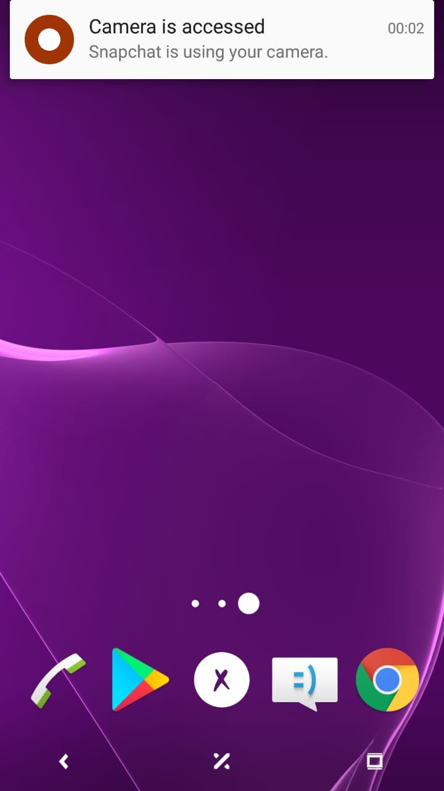
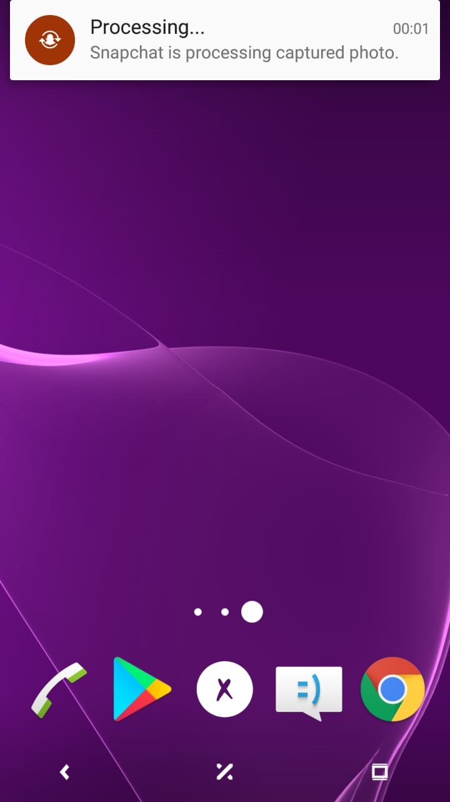

# Privacy Nudge - Notification

For research purposes (my bachelor thesis), we wanted to investigate users' feelings and reaction regarding Apps that use front-facing camera. I designed 3 different mock-up feedback tools to inform/notify users that their front camera is accessed in real time.

This tool is about sending heads-up notifications to inform/notify users that their front-facing camera has been accessed.  

## Screenshots

